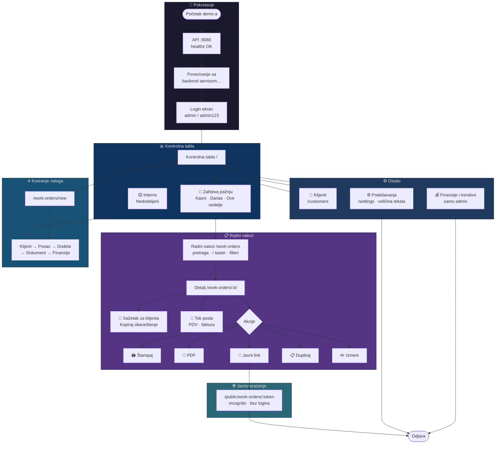
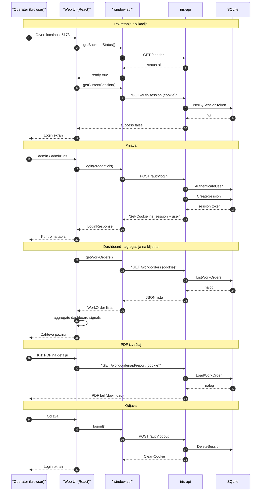
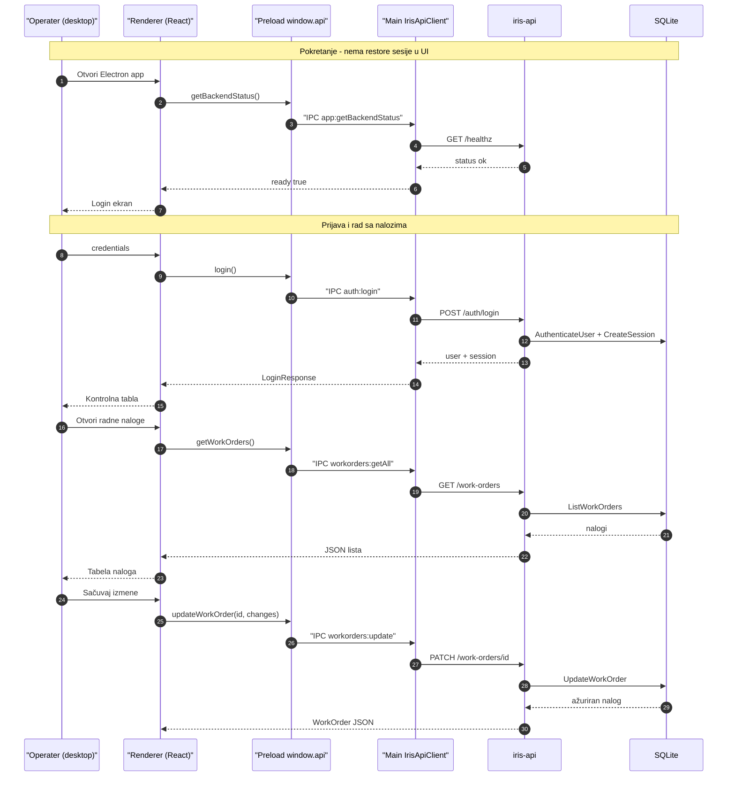
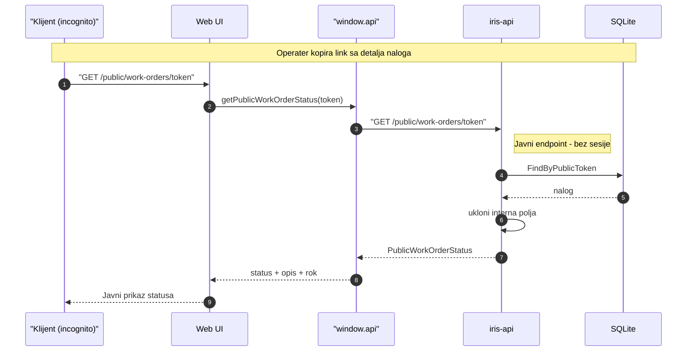

# Iris — vodič za klijentski demo (srpski)

> **Developer notes** — interni materijal za prezentaciju aplikacije klijentu.  
> Preporučena dužina: **15–20 minuta** (+ 5 min pitanja).  
> Glavna površina za demo: **web aplikacija** (`apps/web`).  
> **Poslednja provera:** `main` @ 2026-06-22 (posle pull-a).

---

## Šta je novo u trenutnoj verziji (bitno za demo)

| Promena | Zašto je važno |
|---------|----------------|
| **Provera backend-a pri startu** | Ako API nije pokrenut, vidi se *„Backend nije dostupan“* — ne login |
| **„Povezivanje sa backend servisom…“** | Kratko učitavanje pre logina — normalno, sačekaj |
| **Sažetak za klijenta + Kopiraj obaveštenje** | Na detalju naloga — gotov tekst za Viber/email |
| **Tok posla** (timeline) | Vizuelna istorija događaja na nalogu |
| **Pretraga tasterom `/`** | Na listi naloga — brz demo trik |
| **Filteri kao „pill“ dugmad** | Status, tip dokumenta, red (Kasne/Danas…), datumi |
| **Toast obaveštenja** | Potvrda nakon čuvanja, promene statusa, kopiranja |
| **Podešavanja — tema, veličina teksta, gustina, šifarnici** | Svetla/tamna tema, 4 veličine teksta, gustina liste, i admin šifarnici (uklj. *jedinicu mere*) |
| Dugme **Izmeni** (ne „Uredi“) | Vodi na `/work-orders/:id/edit` |
| **Interno** sekcija na dashboardu | Sklopljena — materijal i nedodeljeni nalozi |

---

## Brzi pregled — šta je Iris?

**Iris** je operativni sistem za štampariju **Grafika Čobanović**. Pokriva ceo tok posla:

- prijem i vođenje **radnih naloga** (od novog naloga do fakturisanja),
- **klijente i adrese isporuke**,
- **kontrolnu tablu** sa signalima „šta hitno traži pažnju“,
- **javni link** gde klijent bez logina vidi status svog naloga,
- **PDF izveštaj** i **štampu** radnog naloga,
- (admin) **finansije i trendove**.

Arhitektura: web + desktop (Electron) + Go API + SQLite — sve deli istu bazu.

---

## Priprema pre demo-a (obavezno uraditi večeras / ujutru)

### Opcija A — pun stack (preporučeno za demo sa PDF-om i javnim linkom)

**Redosled je bitan: prvo API, pa web.** Web aplikacija na startu zove `GET /healthz` — bez API-ja neće doći do logina.

```bash
# Terminal 1 — API (PRVO!)
cd iris-api
DATABASE_PATH=./data/iris.db go run ./cmd/irisctl migrate
DATABASE_PATH=./data/iris.db go run ./cmd/irisctl seed-demo
DATABASE_PATH=./data/iris.db IRIS_SESSION_SECRET=dev-secret-change-me go run ./cmd/server

# Sačekaj healthz, pa tek onda Terminal 2 — web
curl http://localhost:8080/healthz   # → {"status":"ok"}

# Terminal 2 — web
cd apps/web
npm install   # samo ako nije već
npm run dev
```

- Otvori: **http://localhost:5173**
- Vidiš: *„Povezivanje sa backend servisom…“* → login ekran
- Login: **`admin`** / **`admin123`**

### Opcija B — Docker (production-like, jedan port)

```bash
scripts/docker-up.sh --seed
# → http://localhost:8080
```

### Opcija C — samo UI (bez backend-a, hitna rezerva)

```bash
cd apps/web
VITE_IRIS_API_MODE=fixtures npm run dev
```

- Radi login i navigacija, ali **PDF i pravi javni link ne rade** kao u produkciji.
- Koristi samo ako API ne uspe da se podigne.

### Checklist pre nego što klijent uđe

- [ ] **API pokrenut pre web-a** (`healthz` OK) — inače: *Backend nije dostupan*
- [ ] Web već učitan i ulogovan kao **admin** (da vidiš finansije)
- [ ] Otvoren **drugi prozor / incognito** za javni link (pripremi unapred)
- [ ] U Notes: jedan **javni link** kopiran sa detalja naloga (dugme *Javni link*)
- [ ] Zatvoren nepotreban tab, notifikacije na „Do Not Disturb“
- [ ] Rezolucija ekrana min. **1280px** (sidebar + tabele; na mobilnom hamburger meni)
- [ ] Znaš bar **2–3 broja naloga** iz seed-a (npr. `RN-2024-0001`, `RN-2024-0002`)
- [ ] Proverio si da **PDF** otvara bar jednom (chromedp može kasniti 5–10 s)

### Demo podaci (seed-demo)

| Entitet | Broj |
|---------|------|
| Korisnici | 1 (`admin`) |
| Klijenti | 5 |
| Lokacije | 5 |
| Radni nalozi | 28 |

Primeri klijenata: Firma Doo, Kompanija AB, Studio XYZ, Agencija Pro…  
Poslovi: vizitkarte, katalozi, plakati, flajeri — sve na srpskom.

---

## Mapa stranica (web)

| Redosled u demo-u | URL | Naziv u meniju |
|-------------------|-----|----------------|
| 0 | *(login ekran)* | — |
| 1 | `/` | Kontrolna tabla |
| 2 | `/work-orders` | Radni nalozi |
| 3 | `/work-orders/:id` | Detalj naloga |
| 4 | `/public/work-orders/:token` | Javni status *(incognito)* |
| 5 | `/work-orders/new` | Novi nalog |
| 6 | `/customers` | Klijenti |
| 7 | `/settings` | Podešavanja |
| 8 | `/` *(ponovo)* | Finansije i trendovi |

**Napomena:** README pominje `/track/{token}` — **taj put ne postoji**. Ispravan javni URL je `/public/work-orders/{token}`.

---

## Dijagram toka aplikacije (Mermaid)



---

## Sekvencijski dijagrami (Mermaid)

### 1. Web — pokretanje, prijava i kontrolna tabla



### 2. Desktop — isti API preko Electron IPC



### 3. Javno praćenje — bez prijave



**Napomene:**
- Web i desktop dele **isti REST API** i **istu SQLite** bazu.
- Web čuva sesiju u **HTTP-only cookie** (`iris_session`); desktop drži korisnika u **memoriji renderera** posle logina.
- Dashboard metrike se **računaju u browseru** — server vraća sirove naloge.
- Javni endpoint vraća samo polja bezbedna za klijenta (bez internih beleški).

---

## Statusi radnog naloga (zapamti ovo)

| Status | Label u UI | Značenje (jedna rečenica) |
|--------|------------|---------------------------|
| `new` | Nov | Nalog kreiran, niko nije dodeljen |
| `assigned` | Dodeljen | Operater i datum planirani |
| `inProgress` | U toku | Štampa u toku |
| `completed` | Završen | Posao gotov, spreman za fakturisanje |
| `invoiced` | Fakturisan | Zatvoren sa fakturom |
| `cancelled` | Otkazan | Otkazan posao |

**Tok za klijenta:** Nov → Dodeljen → U toku → Završen → Fakturisan.

---

## Scenarij prezentacije — korak po korak

### 0. Uvod (1 min) — pre logina

**Šta reći:**

> „Danas vam pokazujem **Iris** — sistem koji smo napravili za vođenje radnih naloga u štampariji. Sve je na srpskom, prilagođeno vašem poslu: vizitkarte, katalozi, plakati, isporuka, fakturisanje. Imate **web aplikaciju** za kancelariju i **desktop** za rad u štampariji — obe koriste istu bazu.“

**Ne otvaraj još aplikaciju** dok ne kažeš kontekst.

---

### 1. Login (1 min)

**Stranica:** prvo *„Povezivanje sa backend servisom…“*, zatim login (ako nisi ulogovan)

**Akcije:**
- Unesi `admin` / `admin123`
- Opciono pokaži „Zapamti uređaj“
- Ukazati na tagline: *„Sistem za vođenje radnih naloga u štampariji. Svaki posao je evidentiran.“*

**Šta reći:**

> „Pre logina aplikacija proverava da li je server dostupan — u produkciji to znači da niko ne radi u praznu. Pristup je zaštićen sesijom; administrator vidi finansije, operater vodi naloge. Reset lozinke ide preko administratora — nema samoregistracije.“

**Ne govori:** cookie, lazy loading, React — osim ako pitaju.

---

### 2. Kontrolna tabla `/` (3 min) — **NAJVAŽNIJI PRVI EKRAN**

**Podnaslov stranice:** *„Klijenti, rokovi i otvoreni redovi rada“*

**Šta pokazati:**

1. **Sidebar** — Iris / Grafika Čobanović; na dnu: Podešavanja, korisnik, Odjava; *Skupi meni* na desktopu
2. Sekcija **„Zahteva pažnju“** — filteri (dugmad sa brojevima):
   - **Kasni**, **Danas**, **Ove nedelje**
3. Lista **po klijentima** — klikni red → otvara filtrirane naloge
4. Sklopljena sekcija **„Interno“** — *Nedodeljeni* (otvori ako ima vremena)
5. **„Finansije i trendovi“** (sklopljeno `<details>`) — otvori na kraju, samo admin

**Šta reći:**

> „Ovo je **radni sto**, ne Excel. Odmah vidite šta gori — po klijentu, od najhitnijeg ka manje hitnom. Interni signali (materijal, nedodeljeno) su odvojeni od onoga što se tiče rokova prema klijentu. Administrator ispod vidi prihod i trendove.“

**Ključna poruka:** *„Sistem vas vodi ka hitnom, ne lovite redove ručno.“*

**Akcija:** klikni klijenta sa signalom **Kasni** ili **Danas**.

---

### 3. Lista radnih naloga `/work-orders` (2 min)

**Šta pokazati:**

- **Pretraga** — ukucaj deo imena klijenta; demo trik: pritisni **`/`** da fokusira pretragu
- **Filter pill-ovi:** Svi statusi, Svi tipovi, Sve dostave, **Svi redovi** (Kasne / Danas / Ove nedelje / Nedodeljeni)
- **Datumi** — od/do (date picker)
- Tabela: sortiranje kolona, status bedž, cena, operater
- **Brza promena statusa** klikom na status u tabeli (toast potvrda) — samo gde je dozvoljeno
- Akcije u redu: **Izmeni**, **Dupliraj**, **Obriši** — *ne briši na demo-u*
- Dugme **Novi radni nalog** gore desno

**Šta reći:**

> „Kompletan registar sa pametnim filterima. Red *Kasne* odgovara dashboardu. Status se menja iz liste gde ima smisla — sistem vas obavesti toast porukom. Sortiranje po roku, klijentu ili ceni.“

**Demo trik:** filter **Kasne** ili status **U toku** — posle `seed-demo` uvek ima sadržaja.

---

### 4. Detalj radnog naloga `/work-orders/:id` (4 min) — **DRUGI KLJUČNI MOMENT**

**Otvori:** nalog sa bogatim podacima (npr. `RN-2024-0001` vizitkarte ili `RN-2024-0002` katalog)

**Šta pokazati redom:**

| Deo ekrana | Na šta ukazati |
|------------|----------------|
| Zaglavlje | Broj naloga, status bedž, dugmad desno |
| **Sažetak za klijenta** | Sledeći korak + **Kopiraj obaveštenje** (Viber/email) |
| Meta traka | Tip dokumenta, operater, plan, dostava, rok, broj dokumenta |
| **Tok posla** | Timeline događaja (levo) — uklj. izmene polja sa prikazom *stara → nova vrednost* |
| Posao / materijal | Opis, gramatura, dimenzije, utrošak, evidencija rada |
| Napomene | **Interne** vs **za klijenta** — privatnost |
| Faktura | Nacrt, stavke sa **jedinicom mere** (kom / m² / set + sopstvene), osnovica, **PDV 20%**, *Za uplatu* |
| Dugmad | **Pomeri u …** (sledeći status), **Štampaj**, **PDF**, **Javni link**, **Dupliraj**, **Izmeni**, **Obriši** |

**Šta reći:**

> „Jedan nalog drži sve. Gore imate **gotov tekst za klijenta** — kopirate u poruku. **Tok posla** pokazuje ko je šta radio i kada. Interne napomene ne idu na javni link. Na dnu cena sa PDV-om i nacrt fakture.“

**Obavezno uradi uživo:**

1. **Kopiraj obaveštenje** → pokaži toast *„Obaveštenje je kopirano“*
2. **Javni link** → incognito → javni status
3. **PDF** → novi tab (sačekaj 5–10 s ako kasni)
4. *(Opciono)* **Dupliraj** — isti posao, novi broj

**Ključna poruka:** *„Manje telefona — link za status, gotov tekst za obaveštenje.“*

---

### 5. Javni status `/public/work-orders/:token` (2 min) — **WOW MOMENT**

**Stranica:** incognito, bez logina (naslov: *Iris · javni status*)

**Šta se vidi:** broj naloga, klijent, opis posla, status, rok, broj napomena za klijenta, potpis (ako postoji)  
**Šta se NE vidi:** interne napomene, cene, PDV, materijal, faktura, operateri

**Šta reći:**

> „Ono što klijent vidi na telefonu — bez naloga. Vi šaljete link; on vidi status i rok. Sve osetljivo ostaje u štampariji.“

---

### 6. Novi radni nalog `/work-orders/new` (3 min)

**Prođi sekcije forme (ne moraš sve popuniti):**

1. **Klijent** — izbor postojećeg
2. **Posao** — opis, šifra, gramatura, dimenzije, količina, dorada
3. **Dodela i raspored** — operater, prioritet, datum
4. **Dokument i isporuka** — tip dokumenta, način dostave, adresa
5. **Finansije i napomena** — cena, napomene

**Šta reći:**

> „Prijem posla ide kroz isti obrazac — ništa se ne gubi u porukama na WhatsAppu. Od jednog mesta ide zaduženje, rok i fakturisanje.“

**Demo trik:** posle čuvanja — toast *„Radni nalog RN-… je kreiran“* i nalog se vidi na listi/dashboardu.

**Ne radi:** komplikovano editovanje svih polja ako ti je malo vremena.

---

### 7. Klijenti `/customers` (2 min)

**Šta pokazati:**

- Lista klijenata (naziv, kontakt, email, telefon)
- **Lokacije** ispod klijenta — adrese isporuke
- Dodavanje / izmena *(kratko)*

**Šta reći:**

> „Klijent je jednom unet — adrese isporuke se ne kucaju iznova na svakom nalogu. To smanjuje greške u dostavi.“

---

### 8. Podešavanja `/settings` (45 sek — opciono)

**Šta pokazati:**

- **Tema** — Svetla / Tamna
- **Veličina teksta** — Mala / Podrazumevana / Velika / Veoma velika; sekcija *Pregled* ispod (popovi i padajuće liste ostaju ispravno pozicionirani i na najvećem uvećanju)
- **Gustina liste** — zbijeno ↔ udobno
- **Šifarnici** (samo admin) — sopstvene vrednosti za padajuće liste: način dostave, plaćanje poštarine, tip dokumenta, prioritet i **jedinica mere**. Ugrađene vrednosti su zaključane; dodate vrednosti odmah postaju izbor u obrascu naloga.

**Šta reći:**

> „Operater u štampariji može uvećati ceo prikaz i prebaciti na tamnu temu — pamti se na uređaju. Admin kroz **šifarnike** dodaje sopstvene vrednosti, npr. novu **jedinicu mere** (tabak, paleta…) ili način dostave — bez izmene koda.“

---

### 9. Povratak na dashboard — Finansije (1 min, admin)

**Otvori:** **Finansije i trendovi**

**Pokaži:** Ukupno naloga, Završeni, Otvoreni, Ukupan prihod + grafici (meseci, isporuka, top klijenti)

**Šta reći:**

> „Za vlasnika ili office — pregled prihoda i opterećenja, filtriran po periodu i operateru.“

---

### 10. Završetak (1 min)

**Šta reći:**

> „Iris pokriva put od **poziva klijenta** do **fakturisanog naloga**, sa **javnim praćenjem** za klijenta i **tablom** za vas. Web za kancelariju, desktop za rad u štampariji — ista baza, isti podaci. Spremni smo za vaše specifične zahteve oko integracija i obuke tima.“

**Odjava** — pokaži da sesija sigurno izlazi.

---

## Redosled stranica — cheat sheet (copy/paste)

```
0. API :8080 + healthz
1. Login (backend check → admin/admin123)
2. /                          → Zahteva pažnju + Interno
3. /work-orders               → / pretraga, filter Kasne
4. /work-orders/:id           → Sažetak + Kopiraj obaveštenje + PDF + Javni link
5. incognito: /public/work-orders/:token
6. /work-orders/new           → kratko kreiranje + toast
7. /customers                 → klijent + lokacija
8. /settings                  → veličina teksta (opciono)
9. /                          → Finansije i trendovi
10. Odjava
```

---

## Najvažnije stvari koje MORAJU biti pokrivene

| Prioritet | Tema | Zašto je bitno |
|-----------|------|----------------|
| P0 | Backend dostupan pre demo-a | Bez API-ja nema logina — samo *Backend nije dostupan* |
| P0 | Kontrolna tabla / „Zahteva pažnju“ | Glavna vrednost — operativna kontrola |
| P0 | **Sažetak za klijenta** + Kopiraj obaveštenje | Praktična korist odmah (Viber/email) |
| P0 | Javni link (incognito) | Manje telefonskih poziva |
| P0 | Interne vs klijentske napomene | Poverenje i privatnost |
| P1 | Tok posla + statusi | Kako se posao vodi kroz vreme |
| P1 | Forma novog naloga + toast | Prijem posla bez haosa |
| P1 | Klijenti i lokacije | Master podaci |
| P1 | Pretraga `/` i filteri | Brz rad u svakodnevici |
| P2 | PDF / štampa | Arhiva |
| P2 | Dupliraj / Izmeni | Ponavljanje i korekcije |
| P2 | Finansije i trendovi | Za vlasnika |
| P3 | Podešavanja — veličina teksta | Shop floor |
| P3 | Desktop aplikacija | Samo ako pitaju |

---

## Šta NE raditi na demo-u

- **Ne pokreći web pre API-ja** — izgleda kao da aplikacija „ne radi“
- **Ne briši** klijente ili naloge (dugme Obriši postoji — samo admin; demo podaci su ograničeni)
- **Ne pokazuj** pogrešan URL `/track/...` — ispravno: `/public/work-orders/{token}`
- **Ne ulazi** u fixture mod ako obećavaš PDF i pravi javni link
- **Ne gubi se** u svim poljima forme — pokaži strukturu sekcija
- **Ne pričaj** o SQLite, Go, Electron — fokus na posao
- **Ne demo-uj** `user` ulogu na početku — nema **Finansije i trendovi**

---

## Ako nešto pođe po zlu — plan B

| Problem | Rešenje |
|---------|---------|
| **Backend nije dostupan** | Pokreni API u Terminal 1; klikni *Pokušaj ponovo* ili refresh |
| Ekran *Povezivanje…* ne nestaje | Proveri `:8080/healthz`; CORS/origin — web mora biti na `localhost:5173` |
| API ne radi uopšte | `VITE_IRIS_API_MODE=fixtures npm run dev` — objasni „offline UI preview“ |
| PDF ne otvara | Preskoči PDF; pokaži **Štampaj** |
| Javni link ne radi | Kopiraj ponovo sa detalja; URL mora biti `/public/work-orders/...` |
| Spor PDF (chromedp) | Pričaj 5–10 s dok se generiše |
| Prazan dashboard | Pokreni `seed-demo` ponovo |
| Pogrešna lozinka | `admin` / `admin123` |
| Kratko „Učitavanje…“ pri navigaciji | Normalno (lazy učitavanje stranica) — ignoriši |

---

## Odgovori na verovatna pitanja klijenta

**„Može li klijent sam da naruči?“**  
→ Trenutno ne — sistem je za interni rad; javni deo je samo **praćenje statusa**.

**„Radi li na telefonu?“**  
→ Web je responzivan; sidebar postaje hamburger meni.

**„Gde su podaci?“**  
→ Lokalna baza (SQLite); mogu backup i deploy u Dockeru — detalji po potrebi.

**„Više korisnika istovremeno?“**  
→ Da, sesije po korisniku; uloge admin i operater.

**„Integracija sa fiskalnim / ERP?“**  
→ Nacrt fakture postoji; punu integraciju planirati u narednoj fazi (prilagodi stvarnom stanju projekta).

**„Šta operater vidi vs admin?“**  
→ Operater: naloge, klijente, dashboard bez **Finansije i trendovi**. Admin: sve.

---

## Desktop aplikacija (samo ako pitaju)

- Putanja: `apps/desktop` → `npm run dev` (API na `:8080`)
- Isti **backend check** na startu (*Povezivanje sa backend servisom…*)
- **Samo admin** može da se uloguje; `user` vidi *Nemate dozvolu*
- Ima: dashboard, radni nalozi — **nema** klijente, podešavanja, javnog linka
- Poruka: „Terminal u štampariji — isti podaci, fokus na izvršenje“

---

## Predloženi timing (20 min)

| Min | Segment |
|-----|---------|
| 0–1 | Uvod |
| 1–2 | Login |
| 2–5 | Dashboard / pažnja |
| 5–7 | Lista naloga |
| 7–11 | Detalj + javni link + PDF |
| 11–14 | Novi nalog |
| 14–16 | Klijenti |
| 16–18 | Finansije |
| 18–20 | Zaključak + pitanja |

---

## Jedna rečenica za ceo proizvod

> **Iris je digitalni radni sto štamparije: vidite šta je hitno, vodite nalog od prijema do fakture, a klijent prati status preko linka — bez haosa u porukama i tabelama.**

---

*Poslednja provera: `main`, 2026-06-22 — usklađeno sa pull-om (backend bootstrap, UX poboljšanja, Sažetak za klijenta).*
